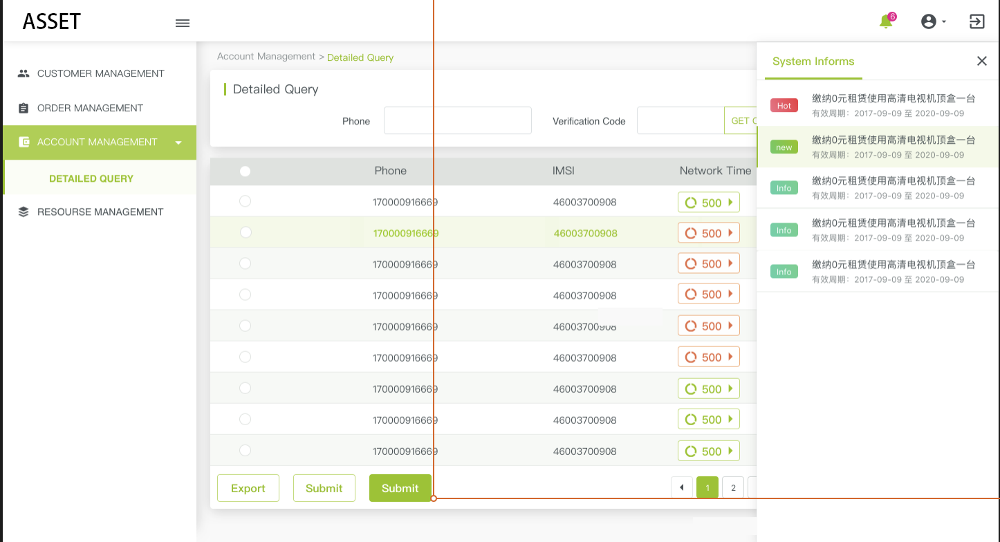

# vue-frame-crm
> vue component for crm system


#### Install

> npm install vue-frame-crm --save || npm install vue-frame-crm@xxx --save

#### 编译和发布
1. npm run build 进行编译和打包
2. 切换到当前项目目录
3. 切换npm源到npm源（https://registry.npmjs.org/）: 只针对有自身源的情况
4. npm login
5. 修改package.json的版本号
6. npm publish

#### Useage

- frame component install

```js
/**
 * 需要将frame组件注册到Vue中
 */
/* 全局注册 */
import Vue from 'vue'
import { TFrame } from 'vue-frame-crm'
Vue.use(TFame)

/* 局部注册， */
import { TFrame } from 'vue-frame-crm'
export default {
    ...
    components: {
        TFrame
    },
    ...
}

/**
 * 在模版中使用
 */
<t-frame
    :img="img"
    :imgMin="imgMin"
    :logo-router="logoRouter"
    :authorization="authorization"
    :tag="tag"
    :count="count"
    :navs="navs"
    :instance="$cmi">
</t-frame>

export default {
    data () {
        return {
            logoRouter: { name: 'portal'},
            img: img,
            imgMin: imgMin,
            authorization: authorization,
            tag: 'CRM',
            menuList: [],
            navs: [
              {
                type: 'icon',
                icon: 'bell'
              },
              {
                type: 'dropdown',
                icon: 'account-circle',
                children: [
                  {
                    name: 'icon1'
                  },
                  {
                    name: 'icon2'
                  },
                  {
                    name: 'icon3'
                  }
                ]
              },
              {
                type: 'icon',
                icon: 'arrow-right-bold-box-outline',
                handleType: 'logout'
              }
            ],
            count: 6
        }
    }
}

```

- frame 组件的提供的参数
  - img [string]
    左上角的logo图标

  - imgMin [string]
    左上角的logo缩小图标

  - logoRouter [object]
    左上角的logo图标的路由

  - authorization [object]
    配置文件设置

  - tag [string]
    当前系统的类型，用于判断是否在本系统中跳转

  - count [number]
    右上角未读消息的个数

  - menuList
    渲染menu菜单
    {
     iconType, 一级菜单的右侧icon的type，对应的是aidesign的图标库
     menuName, 当前菜单的名称
     menuUrl, 路由url
     systemUrl, 非本系统host路由 (根据rightTag 与 tag),非本项目的链接 systemUrl + menuUrl
    }

  - activeMenu [String, Number]
    当前展开的menu

  - navs [array]
    渲染头部menu
    {
     type, 'icon'| 'dropdown' | 'avatar'
     icon, 图标icon的type，对应的是aidesign的图标库
     children, 如果是dropdown时需要提供dropdownitem
    }

```js
    navs: [
      {
        type: 'icon',
        icon: 'bell'
      },
      {
        type: 'dropdown',
        icon: 'account-circle',
        children: [
          {
            name: 'icon1'
          },
          {
            name: 'icon2'
          },
          {
            name: 'icon3'
          }
        ]
      },
      {
        type: 'icon',
        icon: 'arrow-right-bold-box-outline',
        handleType: 'logout'
      }
    ]
```
  - instance
    服务调用实例

#### http 请求注入

> 以auth2的方式，将存在sessionStorage中token注册入请求头中（传入的是axios的实例）

- 用法

```js
/**
 * httpHandle 有两个函数
 * requestInterceptor (config, authorization, tokenUri)
 * handleResponseError (error, authorization)
 * http.js 最写入
 */
import { httpHandle } from 'vue-frame-crm'
import authorization from './authorization.js'

function requestInterceptor (config) {
    ...
    let conf = httpHandle.requestInterceptor(config, authorization, authorization.tokenUri)
    return merge(config, conf)
}
```

#### route 路由注入

> 在进入路由之前判断注册

```js
/**
 * beforeEach(to, from, next, authorization, requestInstance, cb)
 * 在router.js 中写入
 */
import { route } from 'vue-frame-crm'
import authorization from './authorization.js'

router.beforeEach((to, from, next) => {
    route.beforeEach(to, from, next, authorization, http.$cmi)
})
```

